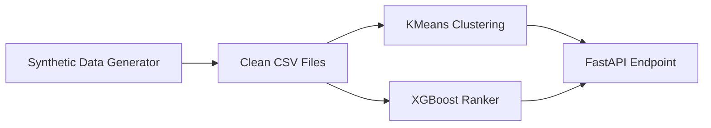

# TripSpot ML Service

The personalization engine behind **TripSpot**. It uses machine learning to identify traveler types and automatically re-rank fare search options based on personal preferences.

---

# ⚙️ Architecture Pipeline



---

# 📁 Project Structure

```
data/
├── generate_synthetic_data.py

app/
├── train_persona_model.py
├── train_ranking_model.py
└── main.py
```

### File Descriptions

| File                              | Description                                                       |
| --------------------------------- | ----------------------------------------------------------------- |
| `data/generate_synthetic_data.py` | Simulates user logs and generates `users.csv` and `choices.csv`.  |
| `app/train_persona_model.py`      | Trains the KMeans clustering model to identify traveler personas. |
| `app/train_ranking_model.py`      | Trains the XGBoost ranking model to predict booking likelihood.   |
| `app/main.py`                     | FastAPI application exposing the ML endpoints on port **8000**.   |

---

# 📊 Model Performance

## Model 1: Traveler Persona (KMeans)

Groups users into **5 traveler archetypes**:

- 💰 Budget
- 💼 Business
- 👨‍👩‍👧‍👦 Family
- 🌍 Explorer
- ✨ Luxury

Uses **13 behavioral features**.

### Performance Metrics

| Metric              | Score    |
| ------------------- | -------- |
| Silhouette Score    | **0.34** |
| Adjusted Rand Index | **0.84** |

> **Silhouette Score:** Good cluster separation.  
> **Adjusted Rand Index:** High agreement with true behavioral labels.

---

## Model 2: Personalized Ranking (XGBoost)

Predicts the probability that a user will select a travel option.

### Performance Metrics

| Metric   | Score     |
| -------- | --------- |
| Accuracy | **86.1%** |
| ROC AUC  | **0.939** |

### Top Influential Features

- Price difference
- Rating
- Transit mode
- Historical price sensitivity

---

# 🔌 API Endpoints

## 1. Identify User Type

**Endpoint**

```http
POST /persona
```

### Input

Past trip history array.

### Output

- Persona name
- Confidence score
- Insight string

---

## 2. Re-Rank Search Options

**Endpoint**

```http
POST /rerank
```

### Input

- User profile
- Search group composition
- Fare options array

### Output

- Re-ranked list of travel options
- Prediction scores
- Human-readable explanation for each recommendation

---

# 🚀 Getting Started

## Local Setup

```powershell
python -m venv venv

.\venv\Scripts\Activate.ps1

pip install -r requirements.txt

python data/generate_synthetic_data.py

python app/train_persona_model.py

python app/train_ranking_model.py

python -m uvicorn app.main:app --reload --port 8000
```

---

## Docker Setup

```bash
docker compose up --build
```

---

# 🛠 Project Status & Limitations

### ✅ Simulated Data

The models are currently trained on **synthetic traveler profiles**.

The pipeline is designed so it can switch to real production telemetry with **zero code changes**.

---

### ⚠️ Profile Overlap

Business and Luxury travelers exhibit similar behavioral characteristics.

**Planned Improvement**

- Add a **weekday travel feature** in the next sprint to improve cluster separation.

---

### 📈 Relative Scoring

Prediction scores are optimized for **ranking travel options**, not estimating absolute booking probabilities.

---

# 🧠 Tech Stack

- Python
- FastAPI
- Scikit-learn (KMeans)
- XGBoost
- Pandas
- NumPy
- Uvicorn
- Docker

---

# 📄 License

This project is intended for educational and demonstration purposes.
